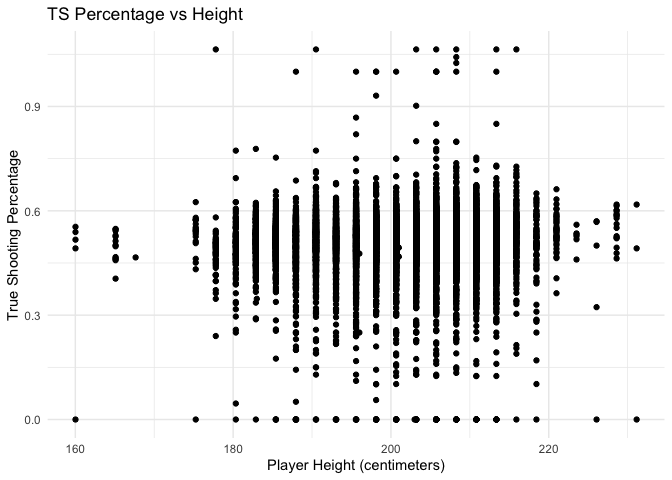
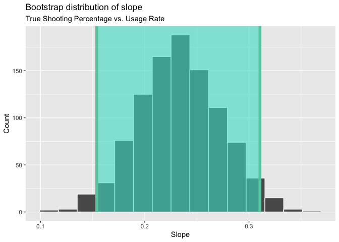
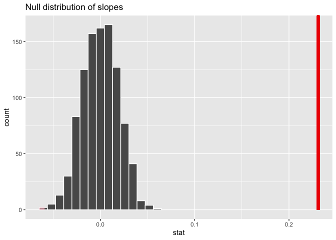
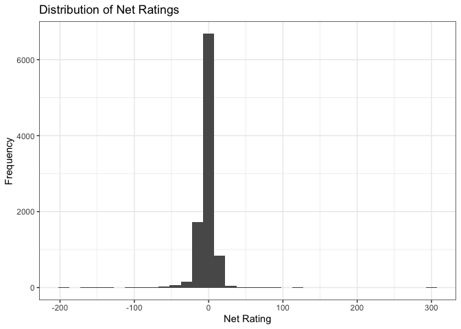
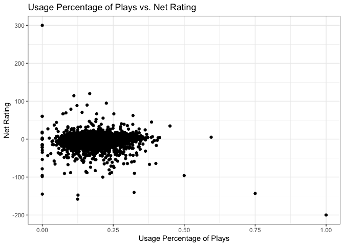
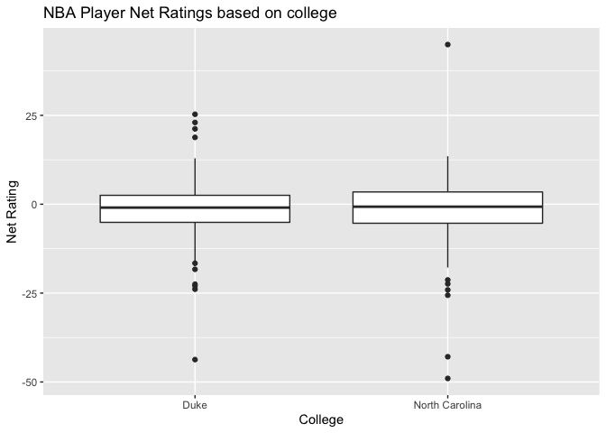
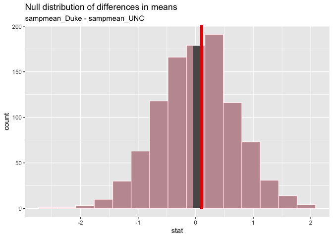

NBA Data Analysis
================
The GTOAT
11/15/19

First, we will load the necessary packages and data for our data
analysis.

``` r
library(tidyverse)
library(broom)
library(infer)
edited_NBA_data <- read_csv("edited_NBA-data.csv")
edited_NBA_data <- edited_NBA_data %>%
  select(2,3,4,5,6,7,8,10,11,12,13,14,15,16,17,18,19)
```

### Question 1

### What are the best predictors of true shooting percentage?

We want to see if we can use variables in our NBA dataset to predict the
true shooting percentage of a player. Let’s first look at the predictive
value of some individual variables.

First, let’s visualize the relationship between age and true shooting
percentage using a simple scatterplot.

``` r
edited_NBA_data %>%
  ggplot(aes(x = player_height, y = ts_pct)) +
  geom_point() +
  labs(x = "Player Height (centimeters)", y = "True Shooting Percentage", title = "TS Percentage vs Height") + 
  theme_minimal()
```

<!-- -->

``` r
cor(edited_NBA_data$player_height, edited_NBA_data$ts_pct)
```

    ## [1] 0.05614384

The correlation coefficient between player height and true shooting
percentage is about .056, indicating a weak, positive relationship
between the two variables. Let’s try to use some other methods to better
predict true shooting percentage.

Next, we’d like to use a linear regression model to explain true
shooting percentage using a player’s usage rate.

``` r
lm(ts_pct ~ usg_pct, data = edited_NBA_data)
```

    ## 
    ## Call:
    ## lm(formula = ts_pct ~ usg_pct, data = edited_NBA_data)
    ## 
    ## Coefficients:
    ## (Intercept)      usg_pct  
    ##      0.4617       0.2312

``` r
ts_model_usg <- lm(ts_pct ~ usg_pct, data = edited_NBA_data)
glance(ts_model_usg)$r.squared
```

    ## [1] 0.01675172

We can see here that the observed regression equation is true shooting
percentage-hat = .462 + usage rate\*.231. The intercept indicates that,
all else equal, a player with a usage rate of 0 is predicted by the
model to have a true shooting percentage of .462. This doesn’t
intuitively make sense as a player can’t shoot the ball without touching
it. The slope of the regression line indicates that for an increase in
usage rate of one, all else equal, the predicted true shooting
perecentage increases by .231. The r-squared for this model is
0.01675172, indicating that 1.7% of the variation in true shooting
percentage is explained by this model

Now, let’s create a 95% confidence interval for the slope of the
regression line predicting true shooting percentage using usage rate. We
do this by creating a bootstrap distribution of slopes and taking the
middle 95% of it.

``` r
set.seed(7)
boot_dist <- edited_NBA_data %>%
  specify(ts_pct ~ usg_pct) %>%
  generate(reps = 1000, type = "bootstrap") %>%
  calculate(stat = "slope")

 percentile_ci <- boot_dist %>%
  summarise(l = quantile(stat, 0.025),
  u = quantile(stat, 0.975))

visualize(boot_dist) +
  shade_confidence_interval(endpoints = percentile_ci) +
  labs(title = "Bootstrap distribution of slope",
       subtitle = "True Shooting Percentage vs. Usage Rate",
       x = "Slope", y = "Count")
```

<!-- -->

We are 95% confident that the true slope of the line indicating the
relationship between true shooting percentage and usage rate is
contained in the interval 0.1538728, 0.3105119. We observe that the
observed sample slope (.231) is within this interval.

Finally, we want to conduct a hypothesis test for the slope of the
regression line predicting true shooting percentage using usage rate to
see if it is statistically significant. Our hypotheses are as follows:

Ho: β = 0 Ha: β \!= 0

where β is the population slope of the regression line predicting true
shooting percentage using usage rate.

We do this by generating a null distribution using permute samples of
slopes, visualizing it, and then calculating the p-value.

``` r
set.seed(7)
null_dist <- edited_NBA_data %>%
  specify(response = ts_pct, explanatory = usg_pct) %>%
  hypothesize(null = "independence") %>%
  generate(reps = 1000, type = "permute") %>%
  calculate(stat = "slope")

obs_slope <- tidy(ts_model_usg) %>%
  select(estimate) %>%
  slice(2) %>% pull()

visualize(null_dist) +
 labs(title = "Null distribution of slopes") +
 shade_p_value(obs_stat = obs_slope, direction = "two_sided")
```

<!-- -->

``` r
get_p_value(null_dist, obs_slope, direction = "two_sided")
```

    ## Warning: Please be cautious in reporting a p-value of 0. This result is an
    ## approximation based on the number of `reps` chosen in the `generate()` step. See
    ## `?get_p_value()` for more information.

    ## # A tibble: 1 x 1
    ##   p_value
    ##     <dbl>
    ## 1       0

We see here that the p-value is approximately 0. Thus, we reject the
null hypothesis and conclude that the slope of the regression line of
true shooting percentage using usage rate is not 0 and that the slope
found is statistically significant. This also fits with our 95%
confidence interval which doesn’t contain a slope of 0. Now, let’s
combine what we’ve found thus far using usage rate and age with some
other variables and see if we can predict true shooting percentage using
a multivariate regression model.

We’re going to use age, usage rate, player height, and player weight as
predictors of usage rate, then perform backward selection and fit the
best regression model using the lowest AIC as our criterion. We’ll also
calculate the p-values for each coefficient. The hypotheses are as
follows:

Ho: β = 0 Ha: β \!= 0

where β is the slope coefficient for each explanatory variable in our
model. Finally, we’ll calculate the r-squared value for our model.

``` r
edit_NBA_data_ts_model <- edited_NBA_data %>%
  filter(!is.na(age) & !is.na(player_height) &
           !is.na(player_weight) &
           !is.na(usg_pct) & !is.na(ts_pct))

full_model <- lm(ts_pct ~ age + usg_pct + player_height +
              player_weight, data = edit_NBA_data_ts_model)

selected_model <- step(full_model, direction = "backward")
```

    ## Start:  AIC=-45536.54
    ## ts_pct ~ age + usg_pct + player_height + player_weight
    ## 
    ##                 Df Sum of Sq    RSS    AIC
    ## - player_weight  1   0.00460 81.591 -45538
    ## <none>                       81.586 -45537
    ## - age            1   0.14321 81.730 -45522
    ## - player_height  1   0.18122 81.768 -45517
    ## - usg_pct        1   1.68722 83.274 -45343
    ## 
    ## Step:  AIC=-45538
    ## ts_pct ~ age + usg_pct + player_height
    ## 
    ##                 Df Sum of Sq    RSS    AIC
    ## <none>                       81.591 -45538
    ## - age            1   0.13974 81.731 -45524
    ## - player_height  1   0.45053 82.042 -45487
    ## - usg_pct        1   1.68309 83.274 -45345

``` r
tidy(selected_model)
```

    ## # A tibble: 4 x 5
    ##   term          estimate std.error statistic  p.value
    ##   <chr>            <dbl>     <dbl>     <dbl>    <dbl>
    ## 1 (Intercept)   0.282     0.0225       12.5  9.43e-36
    ## 2 age           0.000891  0.000220      4.05 5.26e- 5
    ## 3 usg_pct       0.259     0.0184       14.0  2.41e-44
    ## 4 player_height 0.000745  0.000103      7.26 4.04e-13

``` r
glance(selected_model)$AIC
```

    ## [1] -18403.06

``` r
glance(selected_model)$r.squared
```

    ## [1] 0.02360461

Our final model can be written as the following: true shooting
percentage-hat = .000891xage + .259xusg\_pct + 0.000745xplayer\_height +
.282.

Our final model doesn’t use player weight.

Now that we have our final model, let’s interpret the p-values. All
p-values are less than 5, indicating that the coefficients predicting
true shooting percentage using age, player height, player weight, and
usage rate are individually statistically significant and we can reject
the null hypothesis for each and conclude that some relationship exists,
all else equal, between each of these variables and true shooting
percentage.

Finally, let’s interpret the significant coefficients and intercepts of
our model. The intercept is .282, indicating that a 0 year old, 0%
usage, 0 cm tall player is predicted to have a true shooting percentage
of .282. Although this is statistically significant based on its p-value
\<.05, this is not intuitively useful because players have height and
age. The coefficient for age indicates that for every year increase in
age, all else equal, the predicted true shooting percentage increases by
.000891. The coefficient for usg\_pct indicates that for a percentage
increase in usage rate, all else equal, the predicted true shooting
percentage increases by .259. The coefficient for player height
indicates that, all else equal, every cm increase in height increases
the predicted true shooting percentage by .000745.

Our r-squared value is .02360461, indicating that about 2.4% of the
variation in true shooting percentage is explained by our final model.
This shows that the variables we used in this model are probably not
enough to reliably predict true shooting percentage.

### Question 2

### What are the biggest factors in determing a good net rating?

To answer this question, we will construct a linear model that includes
all the variables we are interested in analyzing. We want to determine
which are the best variables in determing a good net rating, or in other
words, what variables have the greatest correlation to a good net rating
of basketball players. We will start with all the relevant variables and
then use backward selection to determine our best fit model. These
relevant variables (that we think (could) affect net rating) are the
following: age, player\_height, player\_weight, average points scored
(PPG), average rebounds, average assists (APG), and percentage of team
plays used by the player.

First we want to sort through our data and make sure that we filter out
any missing values.

``` r
edit_NBA_data <- edited_NBA_data %>%
  filter(!is.na(age) & !is.na(player_height) & !is.na(player_weight) &
           !is.na(pts) & !is.na(reb) & !is.na(ast) & !is.na(usg_pct) &
           !is.na(net_rating))
```

Next, we want to complete just some preliminary exploratory data
analysis. We’ll first visualize the distribution of net ratings.

``` r
ggplot(data = edited_NBA_data, aes(x = net_rating)) +
  geom_histogram(bins = 25, binwidth = 15) + 
  labs(title = "Distribution of Net Ratings", 
       x = "Net Rating", 
       y = "Frequency") + 
  theme_bw()
```

<!-- -->

From our visualization above, we can see that most of the net ratings
are at, or relatively close to, 0. This makes sense because the number
of points scored should equal the number of points allowed when all the
players are combined. Our regression analyis and model selection will
help determine which variables are most influential in affecting these
net ratings.

Before we get to model selection, though, we can also illustrate the
relationship between the variables from the selected model. For example,
we can visualize the correlation between a player’s usage percentage of
team plays and his net rating.

``` r
ggplot(data = edited_NBA_data, aes(x = usg_pct, y = net_rating)) + 
  geom_jitter() + 
  labs(title = "Usage Percentage of Plays vs. Net Rating", 
       x = "Usage Percentage of Plays", 
       y = "Net Rating") + 
  theme_bw()
```

<!-- -->

We can see from this exploratory visualization that the outliers might
indicate a negative relationship between usage percentage and net
rating; as the usage percentage increases, the net rating seems to
decrease. Moreover, the majority of the data points are around a 0.25
usage percentage (or 25%) and their corresponding net ratings suggest a
relatively low rating. Most of the ratings, in fact, seem to center at,
if not slightly below, 0.

We can then use our edited data, now as edit\_NBA\_data, to create our
regression model. We can also display the coefficient estimates in a
more tidy manner (rounded to 3 decimal places) and then interpret the
slopes of age, height, weight, points, rebounds, assists, and usage
percentage.

``` r
(model_netrating <- lm(net_rating ~ age + player_height + player_weight +
                         pts + reb + ast + usg_pct, data = edit_NBA_data))
```

    ## 
    ## Call:
    ## lm(formula = net_rating ~ age + player_height + player_weight + 
    ##     pts + reb + ast + usg_pct, data = edit_NBA_data)
    ## 
    ## Coefficients:
    ##   (Intercept)            age  player_height  player_weight            pts  
    ##       0.18735        0.15585       -0.00544       -0.02288        0.65272  
    ##           reb            ast        usg_pct  
    ##       0.25429        0.13100      -51.81125

``` r
model_netrating %>%
  tidy() %>%
  select(term, estimate) %>%
  mutate(estimate = round(estimate, 3))
```

    ## # A tibble: 8 x 2
    ##   term          estimate
    ##   <chr>            <dbl>
    ## 1 (Intercept)      0.187
    ## 2 age              0.156
    ## 3 player_height   -0.005
    ## 4 player_weight   -0.023
    ## 5 pts              0.653
    ## 6 reb              0.254
    ## 7 ast              0.131
    ## 8 usg_pct        -51.8

Regarding age, our model suggests that for for every year increase in
age, we can predict, on average, that a player’s net rating will
increase by about 0.156 points, holding all other variables constant.

Our slope coefficient for player height suggests that for every
centimeter increase in height, we can predict on average that a player’s
net rating will decrease by about 0.005 points, holding all other
variables constant.

The slope coefficient for player weight indicates that for every
kilogram increase in weight, we can predict on average that a player’s
net rating will decrease by about 0.023 points, holding all other
variables constant.

Our model suggests that for every 1 point increase in the average number
of points of a player, we can predict on average that the player’s net
rating will increase by about 0.653 points, holding all other variables
constant.

For every 1 rebound increase in the player’s average number of rebounds,
we can predict on average that the player’s net rating will increase by
about 0.254 points, holding all other variables constant.

For every 1 assist increase in a player’s average number of assists, we
can predict on average that the player’s net rating will increase by
about 0.131 points, holding all other variables constant.

Lastly, for every 1 percentage increase in the percentage of team plays
used by the player, we can predict on average that the player’s net
rating will decrease by about -51.811 (in decimals). Because this is a
measurement of percentage, the values are decimals, and that explains
the relatively large slope value.

If we were to write our linear model based on this information, it would
look like this:

net-rating-hat = 0.187 + 0.156 \* age - 0.005 \* player\_height - 0.023
\* player\_weight + 0.653 \* pts + 0.254 \* reb + 0.131 \* ast - 51.811
\* usg\_pct

Though we can write our linear model using these variables and their
corresponding slopes, we want to ensure that we have the best fit model
and include slopes that best represent the relationship the variables we
have in regards to net rating. So, we can use backward model selection
to determine this best model and then determine which variables have the
greatest correlation to net rating.

``` r
model_sel <- step(model_netrating, direction = "backward")
```

    ## Start:  AIC=45774.98
    ## net_rating ~ age + player_height + player_weight + pts + reb + 
    ##     ast + usg_pct
    ## 
    ##                 Df Sum of Sq     RSS   AIC
    ## - player_height  1         6 1145620 45773
    ## - ast            1       199 1145812 45775
    ## - player_weight  1       232 1145845 45775
    ## <none>                       1145613 45775
    ## - reb            1      1340 1146953 45784
    ## - age            1      4140 1149754 45807
    ## - pts            1     29407 1175020 46015
    ## - usg_pct        1     35955 1181568 46068
    ## 
    ## Step:  AIC=45773.03
    ## net_rating ~ age + player_weight + pts + reb + ast + usg_pct
    ## 
    ##                 Df Sum of Sq     RSS   AIC
    ## <none>                       1145620 45773
    ## - ast            1       245 1145865 45773
    ## - player_weight  1       544 1146163 45776
    ## - reb            1      1358 1146978 45782
    ## - age            1      4169 1149788 45806
    ## - pts            1     29416 1175035 46013
    ## - usg_pct        1     35991 1181611 46067

Once the process of model selection is complete, we can display the
coefficients, in a tidy form, of the selected model.

``` r
model_sel %>%
  tidy() %>%
  select(term, estimate) %>%
  mutate(estimate = round(estimate, 3))
```

    ## # A tibble: 7 x 2
    ##   term          estimate
    ##   <chr>            <dbl>
    ## 1 (Intercept)     -0.658
    ## 2 age              0.156
    ## 3 player_weight   -0.025
    ## 4 pts              0.652
    ## 5 reb              0.251
    ## 6 ast              0.138
    ## 7 usg_pct        -51.8

``` r
glance(model_sel)$AIC
```

    ## [1] 72907.97

``` r
glance(model_sel)$r.squared
```

    ## [1] 0.100948

Based on this, we can write our final selected model as the following:

final-net-rating-hat = -0.658 + 0.156 \* age - 0.025 \* player\_weight +
0.652 \* pts + 0.251 \* reb + 0.138 \* ast - 51.779 \* usg\_pct

We can also see from these outputs that the slope coefficients are
slightly different, the most different being the intercept - which is
now -0.658 compared to the previous 0.187 value. The rest of the slope
values of this model, though, express minute differences. Also, our code
output indicates our AIC value to be 72907.97 and our R-squared value as
0.100948. This R-squared value tells us that roughly 10.09% of the
variability in players’ net rating can be explained by the variables
listed in our final selected model: age, weight, points, rebounds,
assists, and usage percentage of team plays.

To test the significance of the correlation indicated by these various
coefficients, we can calculate p-values to figure out if a coefficient’s
slope is in fact significantly different from zero. We can use
hypothesis testing for the slope using the Central Limit Theorem, which
tells us the distribution of certain sample statistics if necessary
conditions are met (ie. distribution of the sample statistic is nearly
normal, distribution is centered at the population parameter, the
variability of the distribution is inversely proportional to the square
root of the sample size). We can then use inference methods based on the
CLT, allowing us to use the test statistic to calculate the p-values:
probabilities of distributions given that the slope coefficient is zero.

Our hypotheses for evaluating if a correlation exists between a certain
variable (age, weight, points, rebounds, assists, usage percentage) and
the net rating of a player would be the following: the null indicates
that there is no correlation (slope = 0), and the alternative states
that there is a correlation (slope \!= 0). These hypotheses will be the
same for each coefficient we will test.

Important to note, though, is that there are several conditions for
inference for regression. They are the following: observations should be
independent, residuals should be randomly distributed around 0,
residuals should be nearly normally distributed and centered at 0, and
residuals should have constant variance. Our dataset and the associated
observations meet these requirements.

``` r
tidy(model_sel)
```

    ## # A tibble: 7 x 5
    ##   term          estimate std.error statistic  p.value
    ##   <chr>            <dbl>     <dbl>     <dbl>    <dbl>
    ## 1 (Intercept)    -0.658     1.43      -0.460 6.45e- 1
    ## 2 age             0.156     0.0265     5.90  3.85e- 9
    ## 3 player_weight  -0.0255    0.0120    -2.13  3.32e- 2
    ## 4 pts             0.652     0.0417    15.7   1.30e-54
    ## 5 reb             0.251     0.0745     3.37  7.68e- 4
    ## 6 ast             0.138     0.0966     1.43  1.53e- 1
    ## 7 usg_pct       -51.8       2.99     -17.3   3.12e-66

The following provides us with p-values for each slope coefficient.
Compared to our significance level of 0.05, we can see that the p-values
for age, weight, points, rebounds, and usage percentage are less or
considerably less than 0.05. The p-value for assists, however, is
greater than 0.05. So, we can say that with a p-value greater than 0.05,
we fail to reject the null hypothesis - meaning that the data does do
not provide enough evidence to suggest that the slope for assists is
significantly different from zero. Thus, the p-values indicate that the
there is not significant evidence to suggest a correlation between
average number of assists and the player’s net rating. On the other
hand, based on the p-values for the slope coefficients of age, weight,
points, rebounds and usage percentage, we can say that with a p-value
less than 0.05, we can reject the null hypothesis - meaning that the
data does provide enough evidence to suggest that the slopes for those
coefficients are significantly different from zero. So, taken
independently, the p-values indicate that there is indeed significant
evidence to suggest a correlation between a player’s age and his net
rating, a correlation between a player’s weight and his net rating, a
correlation between a player’s average number of points and his net
rating, a correlation between a player’s average number of rebounds and
his net rating, and a correlation between a player’s usage percentage of
team plays and his net rating.

### Question 3

#### Is there a significant difference between average NBA net rating of players from Duke and players from UNC? If so, which school has players that perform better in the NBA?

For this analysis, we’re focusing on players from Duke and UNC, so we
can create a subset of the data for those players only.

``` r
NBA_data_Duke_UNC <- edited_NBA_data %>%
  filter(college == "Duke" | college == "North Carolina")
```

First, let’s visualize the average net ratings for both players from
Duke and players from UNC.

``` r
ggplot(NBA_data_Duke_UNC, mapping = aes(x = college, y = net_rating)) +
  geom_boxplot() +
  labs(title = "NBA Player Net Ratings based on college",
         x = "College",
         y = "Net Rating") 
```

<!-- -->

``` r
NBA_data_Duke_UNC %>%
  group_by(college) %>%
  summarise(med = median(net_rating), iqr = IQR(net_rating))
```

    ## `summarise()` ungrouping output (override with `.groups` argument)

    ## # A tibble: 2 x 3
    ##   college          med   iqr
    ##   <chr>          <dbl> <dbl>
    ## 1 Duke           -0.95   7.6
    ## 2 North Carolina -0.7    8.8

Just from looking at the side-by-side boxplots and the summary
statistics, there doesn’t seem to be any large differences between the
two populations. However, we can use a hypothesis test to formally
answer this question.

H0: There is no difference in average net rating in the NBA between
players from Duke and players from UNC.

HA: Players from Duke have a higher average net rating in the NBA than
players from UNC.

Next, we calculate the observed sample statistic: Duke avg net\_rating -
UNC avg net\_rating.

``` r
sampmean_diff <- NBA_data_Duke_UNC %>%
 filter(!is.na(net_rating)) %>%
 group_by(college) %>%
 summarise(samp_mean = mean(net_rating)) %>%
 summarise(diff(samp_mean)) %>%
 pull()
```

    ## `summarise()` ungrouping output (override with `.groups` argument)

``` r
sampmean_diff
```

    ## [1] 0.105434

Then, we generate the null distribution.

``` r
set.seed(12345)
null_dist <- NBA_data_Duke_UNC %>%
 filter(!is.na(net_rating)) %>%
 specify(response = net_rating, explanatory = college) %>%
 hypothesize(null = "independence") %>%
 generate(reps = 1000, type = "permute") %>%
 calculate(stat = "diff in means", order = c("Duke", "North Carolina"))
```

And visualize it.

``` r
visualize(null_dist) +
 labs(title = "Null distribution of differences in means",
 subtitle = "sampmean_Duke - sampmean_UNC") +
 shade_p_value(obs_stat = sampmean_diff, direction = "two_sided")
```

<!-- -->

Let’s now calculate the p-value.

``` r
get_p_value(null_dist, sampmean_diff, direction = "two_sided")
```

    ## # A tibble: 1 x 1
    ##   p_value
    ##     <dbl>
    ## 1   0.916

With a p-value of 0.916, which is larger than 0.05, we fail to reject
the null hypothesis in favor of the alternative hypothesis. Therefore,
there is no difference in average net rating in the NBA between players
from Duke and players from UNC.
