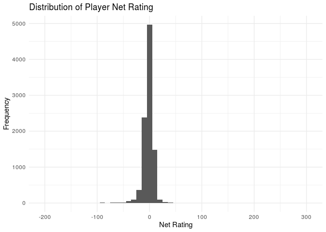
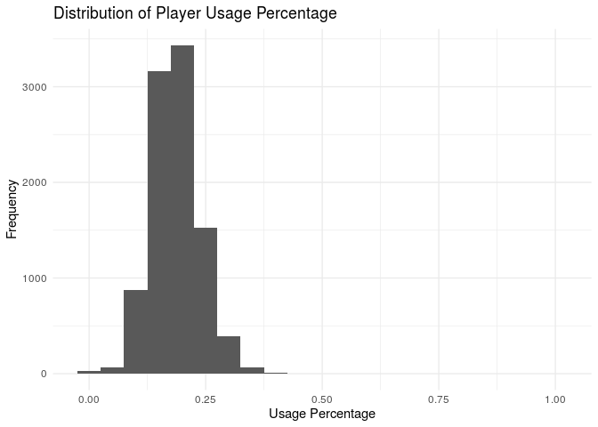
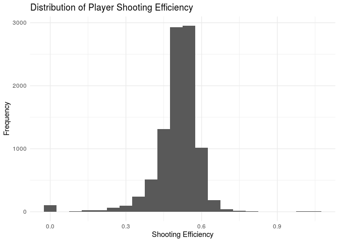
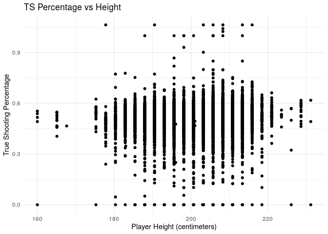
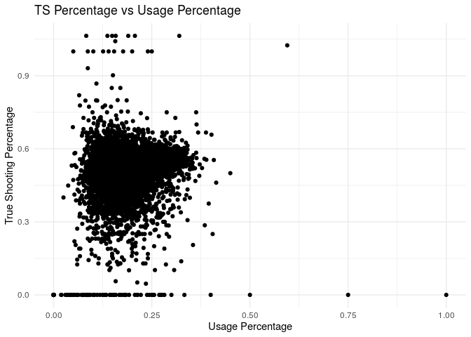

NBA Data Analysis
================
The GTOAT
10/25/19

### Section 1. Introduction

For our research project, we will be analyzing the NBA player statistics
from 1996 to 2016. The data explores the biometric, biographic, and
basic box score features of these players throughout the past two
decades. With data such as this, we can identify trends in one of the
most entertaining types of sport in the US. We are especially curious to
determine the effects of rules amended throughout the years and the ways
that those changes have affected the game. For instance, there now
exists a common tendency of teams scoring above or close to 100 points
each game. How have players adopted to this type of game? Have shooting
percentages increased just as points scored have? Also, we can determine
the geographic diversity of the NBA and how that variety in birthplace
might influence the game. These, and more, are the questions we hope to
explore.

Though the data was found on kaggle.com, it was collected from the NBA
Stats API; it contains 20 years of statistics on each NBA player who has
been part of a team’s roster. The data includes demographic variables
such as age, height, weight, and place of birth, biographical details
such as the team played for, draft year, and round, and basic box score
statistics such as games played, average number of points, rebounds,
assists, etc. The initial pull from NBA Stats API contained 51 rows of
missing data, but those gaps have been manually filled with data from
Basketball Reference.

The cases in the data set represent each NBA player’s statistics for a
specific season who were playing between the years 1996 and 2016. The
variables in the data set are the following: player name (player\_name),
team name abbreviated (team\_abbreviation), age, height in centimeters
(player\_height), weight in kilograms (player\_weight), college attended
(college), birthplace (country), draft year and round (draft\_year,
draft\_round, draft\_number), games played (gp), average points (pts),
average rebounds (reb), average assists (ast), team’s point differential
per 100 possessions while the player is on the court (net\_rating),
percentage of available offensive and defensive rebounds grabbed by the
player (oreb\_pct, dreb\_pct), percentage of team plays used by the
player (usg\_pct), shooting efficiency (ts\_pct), percentage of assists
by the player (ast\_pct), and season.

Though the data set originally listed more than 20 variables, we will
only be using 17. We wanted to include only those that we thought were
most important or impactful in identifying trends. We also wanted to
focus more on relationships that centered on standard averages (points,
rebounds, assists) and player biographic traits (height, weight), rather
than those that centered on the specifics of the player’s draft year,
for instance. To clarify, we will not be including the following
variables: draft round, draft year, draft number, and percentage of
assists by the player.

### Section 2. Exploratory data analysis

Before we begin testing nuanced hypotheses and drawing conclusions from
our data, we want to determine just some basic, exploratory analysis. To
do that, we first need to load the data, as well as edit the data frame
to include only the variables we
    want.

``` r
library(tidyverse)
```

    ## ── Attaching packages ────────────────────────────────────────────────────── tidyverse 1.2.1 ──

    ## ✔ ggplot2 3.2.1     ✔ purrr   0.3.2
    ## ✔ tibble  2.1.3     ✔ dplyr   0.8.3
    ## ✔ tidyr   1.0.0     ✔ stringr 1.4.0
    ## ✔ readr   1.3.1     ✔ forcats 0.4.0

    ## ── Conflicts ───────────────────────────────────────────────────────── tidyverse_conflicts() ──
    ## ✖ dplyr::filter() masks stats::filter()
    ## ✖ dplyr::lag()    masks stats::lag()

``` r
library(readr)
```

``` r
edited_NBA_data <- read_csv("/cloud/project/data/edited_NBA-data.csv")
```

    ## Warning: Missing column names filled in: 'X1' [1]

Once we have loaded the data correctly, then we can edit it to include
our desired variables.

``` r
edited_NBA_data <- edited_NBA_data %>%
  select(2,3,4,5,6,7,8,10,11,12,13,14,15,16,17,18,19)
```

We now want the univariate summary statistics and data visualizations
for some of the variables in our dataset. We want to specifically take a
look at the variables net\_rating, usage percentage, and shooting
efficiency. We will visualize these using histograms.

First, we want to see the summary statistics for each variable. To do
so, we can simply use the summary() function.

``` r
edited_NBA_data %>%
  summary()
```

    ##  player_name        team_abbreviation       age        player_height  
    ##  Length:9561        Length:9561        Min.   :18.00   Min.   :160.0  
    ##  Class :character   Class :character   1st Qu.:24.00   1st Qu.:195.6  
    ##  Mode  :character   Mode  :character   Median :27.00   Median :203.2  
    ##                                        Mean   :27.34   Mean   :201.0  
    ##                                        3rd Qu.:30.00   3rd Qu.:208.3  
    ##                                        Max.   :44.00   Max.   :231.1  
    ##  player_weight      college            country                gp       
    ##  Min.   : 60.33   Length:9561        Length:9561        Min.   : 1.00  
    ##  1st Qu.: 91.17   Class :character   Class :character   1st Qu.:34.00  
    ##  Median :100.70   Mode  :character   Mode  :character   Median :60.00  
    ##  Mean   :100.98                                         Mean   :53.07  
    ##  3rd Qu.:111.13                                         3rd Qu.:75.00  
    ##  Max.   :163.29                                         Max.   :85.00  
    ##       pts              reb              ast           net_rating      
    ##  Min.   : 0.000   Min.   : 0.000   Min.   : 0.000   Min.   :-200.000  
    ##  1st Qu.: 3.500   1st Qu.: 1.800   1st Qu.: 0.500   1st Qu.:  -6.400  
    ##  Median : 6.600   Median : 3.000   Median : 1.200   Median :  -1.400  
    ##  Mean   : 8.071   Mean   : 3.565   Mean   : 1.789   Mean   :  -2.214  
    ##  3rd Qu.:11.400   3rd Qu.: 4.700   3rd Qu.: 2.400   3rd Qu.:   3.100  
    ##  Max.   :35.400   Max.   :16.300   Max.   :11.700   Max.   : 300.000  
    ##     oreb_pct          dreb_pct         usg_pct           ts_pct      
    ##  Min.   :0.00000   Min.   :0.0000   Min.   :0.0000   Min.   :0.0000  
    ##  1st Qu.:0.02300   1st Qu.:0.0970   1st Qu.:0.1520   1st Qu.:0.4760  
    ##  Median :0.04600   Median :0.1340   Median :0.1840   Median :0.5180  
    ##  Mean   :0.05796   Mean   :0.1429   Mean   :0.1866   Mean   :0.5048  
    ##  3rd Qu.:0.08800   3rd Qu.:0.1840   3rd Qu.:0.2180   3rd Qu.:0.5520  
    ##  Max.   :1.00000   Max.   :1.0000   Max.   :1.0000   Max.   :1.0640  
    ##     season         
    ##  Length:9561       
    ##  Class :character  
    ##  Mode  :character  
    ##                    
    ##                    
    ## 

Now, we want to visualize the distribution of net\_rating.

``` r
ggplot(data = edited_NBA_data, mapping = aes(x = net_rating)) +
  geom_histogram(binwidth = 10) +
  labs(title = "Distribution of Player Net Rating",
       x = "Net Rating",
       y = "Frequency") + 
  theme_minimal()
```

<!-- -->

The distribution of net rating is unimodal and normal, and we can see
that most players’ net ratings are around 0. We can also see that there
does not exist a great range of net rating: for the most part, the net
ratings of players remain in about a 200-score-wide spectrum.

We also want to visualize the distribution of usage percentage.

``` r
ggplot(data = edited_NBA_data, mapping = aes(x = usg_pct)) +
  geom_histogram(binwidth = 0.05) +
  labs(title = "Distribution of Player Usage Percentage",
       x = "Usage Percentage",
       y = "Frequency") + 
  theme_minimal()
```

<!-- -->

The distribution of net rating is unimodal and slightly skewed right,
and we can see that most players’ usage percentages are around 0.25.

Finally, we want to visualize the distribution of shooting efficiency.

``` r
ggplot(data = edited_NBA_data, mapping = aes(x = ts_pct)) +
  geom_histogram(binwidth = 0.05) +
  labs(title = "Distribution of Player Shooting Efficiency",
       x = "Shooting Efficiency",
       y = "Frequency") + 
  theme_minimal()
```

<!-- -->
The distribution of shooting efficiency is generally normal and
unimodal, but there is an interesting peak at 0.0, or 0%. We can also
see that most players’ shooting efficiency is around 0.5, or 50%.

Next, we want to look at what variables we can use to predict true
shooting percentage, a measure of players’ offensive shot selection and
efficiency.

First, let’s graph a scatterplot to see if height plays a role.

``` r
edited_NBA_data %>%
  ggplot(aes(x = player_height, y = ts_pct)) +
  geom_point() +
  labs(x = "Player Height (centimeters)", y = "True Shooting Percentage", title = "TS Percentage vs Height") + 
  theme_minimal()
```

<!-- -->

``` r
cor(edited_NBA_data$player_height, edited_NBA_data$ts_pct)
```

    ## [1] 0.05614384

The correlation coefficient between player height and true shooting
percentage is about .056, indicating a weak, positive relationship
between the two variables.

Next, let’s graph a scatterplot to see if weight plays a role.

``` r
edited_NBA_data %>%
  ggplot(aes(x = player_weight, y = ts_pct)) +
  geom_point() +
  labs(x = "Player Weight", y = "True Shooting Percentage", title = "TS Percentage vs Weight") +
  theme_minimal()
```

<!-- -->

``` r
cor(edited_NBA_data$player_weight, edited_NBA_data$ts_pct)
```

    ## [1] 0.04643605

The correlation coefficient between player height and true shooting
percentage is about .046, indicating a weak, positive relationship
between the two variables.

Finally, let’s graph a scatterplot to see if usage percentage plays a
role.

``` r
edited_NBA_data %>%
  ggplot(aes(x = usg_pct, y = ts_pct)) +
  geom_point() +
  labs(x = "Usage Percentage", y = "True Shooting Percentage", title = "TS Percentage vs Usage Percentage") +
  theme_minimal()
```

<!-- -->

``` r
cor(edited_NBA_data$usg_pct, edited_NBA_data$ts_pct)
```

    ## [1] 0.1294284

The correlation coefficient between player height and true shooting
percentage is about .129, indicating an even weaker, positive
relationship between the two variables. In this visualization, we can
easily see that the majority of the points fall right about a 25% usage
percentage, and we can clearly observe a few outliers.

We can see that each of the variables graphed above have a small
relationship with true shooting percentage. Thus, in our project we will
try to propose a multivariate model which will allow us to predict true
shooting percentage based on height, weight, and usage rate.

### Section 3. Research questions

Based on our introductory analysis, we were able to explore the data of
players’ net rankings, usage percentages, and shooting efficiencies. We
were also beginning to conceptualize the relationship of height, weight,
and usage percentage on the true shooting percentages of individual
players. Hence, one question we hope to answer within this project is
this: can we predict true shooting precentages using a statistical
model? Are those statistical models effective or correct?

To begin to answer this, we have to identify our independent and
dependent variables. In this case, height, weight, and usage rate would
be the independent variables, while the true shooting percentage would
be the dependent. To truly identify the influence of each characteristic
on a player’s shooting efficiency, we will try to group by height and
weight levels to see if the prediction increases in accuracy if the
model changes by group. The more specific we are, the better a chance we
have in determining the exact traits that impact, or not, shooting
predictions. We can also compare the expected outcomes with the actual
ones as a way to analyze the effectiveness of using statistical models
to predict true shooting percentages.

We hypothesize that the more variables included to predict shooting
percentages, the more accurate the model would be. For instance, when
only comparing a player’s height with his shooting efficiency, the
correlation may not be that robust. But if we look at other factors,
such as age, average number of points scored, and overall net rating,
the models might be more accurate and more closely resemble the
predictions of shooting efficiency. Hence, we will try to create an
appropriate, multivariate model to prove our hypothesis.

Secondly, we also want to research the relationship between a player’s
usage percentage, average number of points, average number of points and
of assists with his net ranking. In doing so, we could determine the
effectiveness of team plays: one would assume that if a player’s net
ranking, points, and assists were high and so was his usage percentage,
then it would be implied that the team plays are effective. They would
be contributing to the player’s success and potentially vice versa; if
the player is successful and he is using the team plays, then it would
seem as though the plays are effective. Because this would be an
assumption, the very least we could do is determine the relationship
between usage percentage and net ranking. Can we use a player’s usage
percentage to determine his overall net ranking? To indicate how many
average points he will have? If so, are those predictions accurate?

Regarding independent and dependent variables, usage percentage, average
number of points, and average number of assists would all be independent
variables, while net ranking would be dependent. Individually, we would
consider how the three independent variables affect the net ranking;
however, to use this analysis to determine the effectiveness of team
plays or even to answer the questions posed above, we would need to use
a multivariate model. Rather than just average number of points
influencing net ranking of a player, it might be that a multitude of
variables serves as the best determinant of net ranking.

To go about creating this multivariate model, we could isolate the
variables by grouping first by season and then by variable. This would
allow us to better synthesize the effects of each variable on a player’s
net ranking.

### Section 4. Data

Finally, we want to print out a glimpse of the data frame. This allows
us to view the data set and count the variables and observations. Those
values are actually provided to us via the glimpse() function.

``` r
glimpse(edited_NBA_data)
```

    ## Observations: 9,561
    ## Variables: 17
    ## $ player_name       <chr> "Chris Robinson", "Matt Fish", "Matt Bullard",…
    ## $ team_abbreviation <chr> "VAN", "MIA", "HOU", "BOS", "DAL", "TOR", "CLE…
    ## $ age               <dbl> 23, 27, 30, 29, 22, 22, 36, 26, 33, 32, 23, 24…
    ## $ player_height     <dbl> 195.58, 210.82, 208.28, 210.82, 205.74, 198.12…
    ## $ player_weight     <dbl> 90.71840, 106.59412, 106.59412, 111.13004, 106…
    ## $ college           <chr> "Western Kentucky", "North Carolina-Wilmington…
    ## $ country           <chr> "USA", "USA", "USA", "USA", "USA", "USA", "USA…
    ## $ gp                <dbl> 41, 6, 71, 74, 42, 9, 70, 31, 70, 82, 29, 75, …
    ## $ pts               <dbl> 4.6, 0.3, 4.5, 7.8, 3.7, 1.6, 3.2, 2.0, 11.3, …
    ## $ reb               <dbl> 1.7, 0.8, 1.6, 4.4, 1.6, 0.7, 2.7, 1.2, 2.6, 4…
    ## $ ast               <dbl> 1.6, 0.0, 0.9, 1.4, 0.5, 0.4, 0.3, 0.0, 4.9, 1…
    ## $ net_rating        <dbl> -11.4, -15.1, 0.9, -9.0, -14.5, -3.5, 3.5, -17…
    ## $ oreb_pct          <dbl> 0.039, 0.143, 0.016, 0.083, 0.109, 0.087, 0.09…
    ## $ dreb_pct          <dbl> 0.088, 0.267, 0.115, 0.152, 0.118, 0.045, 0.14…
    ## $ usg_pct           <dbl> 0.155, 0.265, 0.151, 0.167, 0.233, 0.135, 0.13…
    ## $ ts_pct            <dbl> 0.486, 0.333, 0.535, 0.542, 0.482, 0.470, 0.55…
    ## $ season            <chr> "1996-97", "1996-97", "1996-97", "1996-97", "1…

We also want to find the number of rows and columns in the data set to
update the codebook and determine the data frame’s dimensions.

``` r
nrow(edited_NBA_data)
```

    ## [1] 9561

``` r
ncol(edited_NBA_data)
```

    ## [1] 17
