NBA by the Numbers: Numbers Never Lie
================
The GTOAT
Due 12/13/19

### Introduction

For our final project, our team wanted to choose a dataset to analyze
that was intriguing and relevant to our individual interests, but also
relatively easy and straightforward to understand. After some research
about the possible topics we could pursue, we ultimately decided on
analyzing NBA player data, as the variables involved were already well
defined and unambiguous. It would also be interesting to see how some of
our preconceived notions about certain statistics in basketball (valuing
a player by their points, rebounds, assists vs. other variables) held up
against statistical analysis.

In regards to the actual dataset we chose, we initially had a broad idea
to look at trends through seasons, including but not limited to the
effects of amended rules in how the games are played and players’
overall average statistics throughout multiple seasons (instead of just
player data from individual games within a single season). The dataset
was found on kaggle.com - it contains 20 years of statistics on each NBA
player who has been part of a team’s roster. The cases in the data set
represent each NBA player’s statistics for specific seasons between the
years 1996 and 2016. The variables in the data set are the following:
player name (player\_name), team name abbreviated (team\_abbreviation),
age, height in centimeters (player\_height), weight in kilograms
(player\_weight), college attended (college), birthplace (country),
draft year and round (draft\_year, draft\_round, draft\_number), games
played (gp), average points (pts), average rebounds (reb), average
assists (ast), team’s point differential per 100 possessions while the
player is on the court (net\_rating), percentage of available offensive
and defensive rebounds grabbed by the player (oreb\_pct, dreb\_pct),
percentage of team plays used by the player (usg\_pct), shooting
efficiency (ts\_pct), percentage of assists by the player (ast\_pct),
and season.

We decided to use only 17 variables, as we wanted to include only those
that we thought were most important and influential in identifying
trends. We also wanted to focus more on relationships that centered on
standard averages (points, rebounds, assists) and player biographic
traits (height, weight), rather than more demographic-based variables
(i.e. player’s draft year). To clarify, we will not be including the
following variables: draft round, draft year, draft number, and
percentage of assists by the player.

We began our proposal wanting to primarily answer more broad/overarching
questions that really emphasized trends throughout time (and secondarily
answering questions about how certain statistics influence each other),
but as we began conducting data analysis, we found that these were more
difficult given the cases and given that the necessary analysis was
often out of this class’s scope. Because of these initial setbacks, we
decided instead to narrow the scope of our questions and ended up with
the following two: what the best predictors of a player’s true shooting
percentage are and if a significant difference between average NBA net
rating of players from Duke and from UNC exists.

#### Question 1: What are the best predictors of true shooting percentage?

We first decided to create univariate distributions on net rating,
player usage percentage, and true shooting as our explanatory data
analysis.

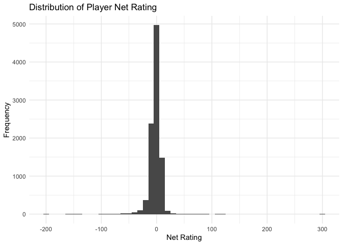<!-- -->

    ## # A tibble: 1 x 2
    ##    mean    sd
    ##   <dbl> <dbl>
    ## 1 -2.21  11.5

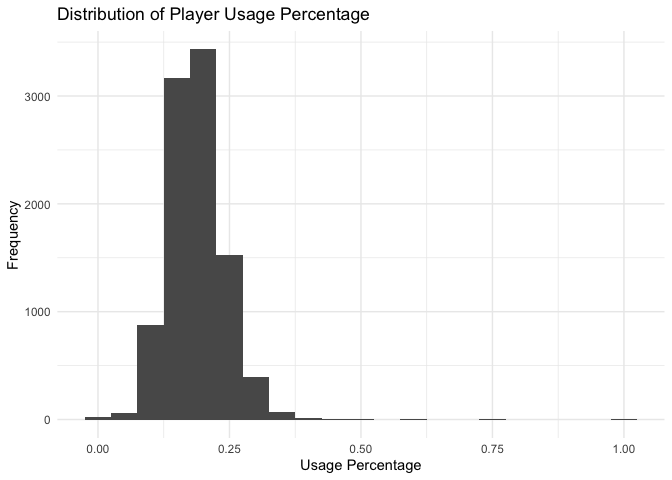<!-- -->

    ## # A tibble: 1 x 2
    ##    mean     sd
    ##   <dbl>  <dbl>
    ## 1 0.187 0.0523

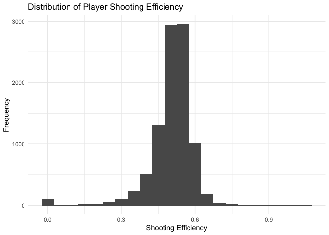<!-- -->

    ## # A tibble: 1 x 2
    ##     med   iqr
    ##   <dbl> <dbl>
    ## 1 0.518 0.076

The summary statistics we chose for the first 2 distributions (net
rating and usage percentage) included mean for center and standard
deviation for spread, while we used median for center and IQR for spread
for the last distribution (true shooting percentage) since it was
slightly skewed left. We found that the mean for net rating was -2.21,
and the standard deviation was 11.545. The mean for usage percentage was
0.1866 (18.66%) and the standard deviation was 0.052. Finally, the
median for true shooting percentage was 0.518 (51.8%) and the IQR was
0.076.

Additionally, to answer our first question regarding true shooting, we
wanted to take a look at some individual correlations between true
shooting percentage and specific variables we had in mind (height,
weight, and usage percentage) and thus displayed the corresponding
bivariate relationships.

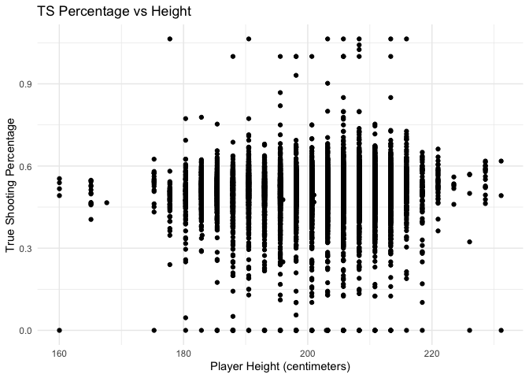<!-- -->

    ## [1] 0.05614384

The correlation coefficient between player height and true shooting
percentage is about 0.056, indicating a weak yet positive relationship
between the two variables.

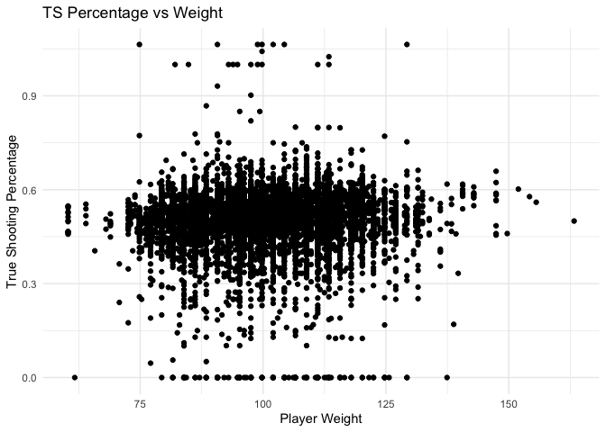<!-- -->

    ## [1] 0.04643605

The correlation coefficient between player weight and true shooting
percentage is about 0.046, indicating a weak, positive relationship
between the two variables - even less than the correlation coefficient
between player height and true shooting percentage.

<!-- -->

    ## [1] 0.1294284

The correlation coefficient between usage percentage and true shooting
percentage is about .129, indicating a weak, positive relationship
between the two variables. Though compared to the other two coefficient
relationships with true shooting percentage, this represents a value of
almost double.

But ultimately, we observed that each of the variables graphed above
have a pretty small relationship with true shooting percentage, which
only further motivated us to try to propose a multivariate model which
would allow us to predict true shooting percentage based on height,
weight, and usage rate - all in an attempt to predict true shooting
percentage with more accuracy.

### Question 1 Analysis and Discussion

Our first question asked about what the best predictors of true shooting
percentage were. We originally planned on using height, weight, and
usage rate as our independent variables to determine the best predictors
of a player’s true shooting percentage. But we decided to also include
player age. We wanted to determine if a multiple variables working
together or single variables as independent factors could more
accurately predict true shooting percentage, so we decided to use a
linear regression model to examine how much true shooting percentage
could be explained only by a player’s usage rate and then use a linear
regression model using multiple variables for comparison.

    ## 
    ## Call:
    ## lm(formula = ts_pct ~ usg_pct, data = edited_NBA_data)
    ## 
    ## Coefficients:
    ## (Intercept)      usg_pct  
    ##      0.4617       0.2312

    ## [1] 0.01675172

We found that the observed regression equation is the following:

true shooting percentage-hat = .462 + usage rate\*.231

The intercept indicates that, with everything else held constant, a
player with a usage rate of 0 is predicted by the model to have a true
shooting percentage of 0.462. This doesn’t intuitively make sense as a
player can’t shoot the ball without touching it. Additionally, the slope
of the regression line indicates that for an increase in usage rate of
one, holding everything else constant, the predicted true shooting
percentage increases by 0.231 on average. The r-squared for this model
is 0.01675172, indicating that 1.68% of the variation in true shooting
percentage is explained by this model.

Next, we wanted to address the uncertainty for the slope of the
aforementioned regression line.

Before we constructed our confidence interval and hypothesis test, we
checked the conditions for inference for regression.

First, we ensured that the observations were independent:

<!-- -->

We could see here that there was no relationship between the order of
data collection and the residuals, which confirmed independence.

Then, we checked if the residuals were randomly distributed around 0:

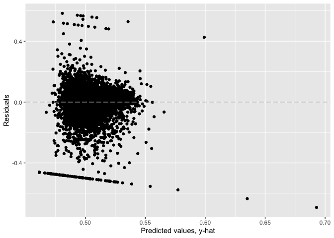<!-- -->

It seemed as though our residuals were generally randomly distributed
around 0 and that they had generally constant variance.

Finally, we checked the normality of the residuals.

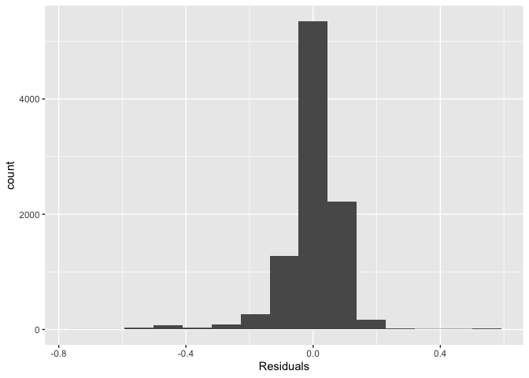<!-- -->

We then determined that our residuals were roughly normally distributed.

Since the conditions for inference for regression were met, we could
create a 95% confidence interval by creating a bootstrap distribution of
slopes and taking the middle 95% of it.

<!-- -->

We are 95% confident that the true slope of the line indicating the
relationship between true shooting percentage and usage rate is
contained in the interval from 0.1538728 to 0.3105119. We can also see
that the observed sample slope (.231) is within this interval.

Additionally, we wanted to conduct a hypothesis test for the slope of
the regression line (predicting true shooting percentage through usage
rate) to see if it is statistically significant and therefore indicative
of an actual relationship between the two.

H0: β = 0 (no relationship)

Ha: β \!= 0 (there is a relationship)

where β is the population slope of the regression line predicting true
shooting percentage using usage rate. We generated a null distribution
using permutation samples of slopes, visualized it, and then calculated
the p-value to determine the validity of our hypothesis.

    ## Warning: Please be cautious in reporting a p-value of 0. This result is an
    ## approximation based on the number of `reps` chosen in the `generate()` step. See
    ## `?get_p_value()` for more information.

    ## # A tibble: 1 x 1
    ##   p_value
    ##     <dbl>
    ## 1       0

With a p-value less than 0.05, we rejected the null hypothesis and
concluded that the slope of the regression line of true shooting
percentage using usage rate is not 0 and that the slope found is
statistically significant. This also fits with what we found in our
earlier 95% confidence interval, which didn’t contain a slope of 0.

Then, we combined what we found so far using usage rate with a few other
variables and tried to see if we could predict true shooting percentage
using a multivariate regression model. We used variables age, usage
rate, player height, and player weight as predictors of usage rate, then
performed backward selection to fit the best regression model using the
lowest AIC as our criterion. We also wanted to calculate the p-values
for each coefficient.

H0: β = 0 (no relationship)

Ha: β \!= 0 (there is a relationship)

where β is the slope coefficient for each explanatory variable in our
model.

    ## Start:  AIC=-45536.54
    ## ts_pct ~ age + usg_pct + player_height + player_weight
    ## 
    ##                 Df Sum of Sq    RSS    AIC
    ## - player_weight  1   0.00460 81.591 -45538
    ## <none>                       81.586 -45537
    ## - age            1   0.14321 81.730 -45522
    ## - player_height  1   0.18122 81.768 -45517
    ## - usg_pct        1   1.68722 83.274 -45343
    ## 
    ## Step:  AIC=-45538
    ## ts_pct ~ age + usg_pct + player_height
    ## 
    ##                 Df Sum of Sq    RSS    AIC
    ## <none>                       81.591 -45538
    ## - age            1   0.13974 81.731 -45524
    ## - player_height  1   0.45053 82.042 -45487
    ## - usg_pct        1   1.68309 83.274 -45345

    ## # A tibble: 4 x 5
    ##   term          estimate std.error statistic  p.value
    ##   <chr>            <dbl>     <dbl>     <dbl>    <dbl>
    ## 1 (Intercept)   0.282     0.0225       12.5  9.43e-36
    ## 2 age           0.000891  0.000220      4.05 5.26e- 5
    ## 3 usg_pct       0.259     0.0184       14.0  2.41e-44
    ## 4 player_height 0.000745  0.000103      7.26 4.04e-13

    ## [1] 0.02360461

Our final model can be written as the following:

true shooting percentage-hat = .000891 \* age + .259 \* usg\_pct +
0.000745 \* player\_height + .282.

All p-values are less than .05, indicating that the coefficients
predicting true shooting percentage of age, player height, and usage
rate are individually statistically significant, so we can reject the
null hypothesis for each and conclude that there exists some
relationship, holding all else constant, between each of these variables
and true shooting percentage.

Finally, we interpreted the coefficients and intercepts of our model.
The intercept is 0.282, indicating that a 0 cm tall player with age 0
and a 0% usage rate is predicted to have a true shooting percentage of
0.282. Although this is statistically significant based on its p-value
being less than 0.05, this is not intuitively useful because these
players have zero heights and ages.

But we can use the model and its coefficient slopes to predict true
shooting percentage for players with nonzero heights, ages, and usage
percentages. Accordingly, the coefficient for age indicates that for
every year increase in age, holding everything else constant, the
predicted true shooting percentage increases by 0.000891 on average. The
coefficient for usg\_pct (usage percentage) indicates that for a
percentage increase in usage rate, holding everything else constant, the
predicted true shooting percentage increases by 0.259 on average. The
coefficient for player height indicates that, all else equal, every
centimeter increase in height increases the predicted true shooting
percentage by 0.000745 on average.

Our r-squared value is 0.02360461, which indicates that about 2.4% of
the variation in true shooting percentage is explained by our final
model. This shows that the variables we used in this model are probably
not enough to reliably predict true shooting percentage.

In regards to our original question, we found that, although there does
exist a statistically significant relationship between age, height,
usage percentage and true shooting percentage and that those 3 variables
are the best predictors of true shooting percentage, they are still not
reliable enough as indicated by an r-squared value of 0.0236.

#### Question 2: Is there a significant difference between average NBA net rating of players from Duke and players from UNC? If so, which school has players that perform better in the NBA?

For the last question, we wanted to explore if there is a true
difference in the average performance, or average net rating, of players
in the NBA who went to Duke versus those who went to UNC. Since both
schools are constantly producing NBA players, and considering the heated
rivalry between the two schools, it made us want to statistically
consider whether or not one school truly producers better NBA players.

To go about this question, we first filtered our dataset to simply
include players who attended either Duke or North Carolina.

Next, we looked at the difference in the distribution of average points
between Duke and UNC players as a sort of exploration of our data.

<!-- -->

    ## `summarise()` ungrouping output (override with `.groups` argument)

    ## # A tibble: 2 x 3
    ##   college          med   iqr
    ##   <chr>          <dbl> <dbl>
    ## 1 Duke             8.7  9.6 
    ## 2 North Carolina   7.9  7.95

We can see here that the median number of points for a Duke player (8.7)
is greater than that of a UNC player (7.9). The spread, as indicated by
the interquartile range, is greater for Duke players (9.6) than for UNC
players (7.95), which demonstrates that Duke produces more variable
point scorers than UNC does. There are multiple high point-scoring
outliers in the UNC distribution that are not matched by the Duke
distribution. The distribution of points is skewed slightly right for
both schools.

Then we looked at the difference in the distribution of average points
between Duke and UNC players as more data exploratory analysis.

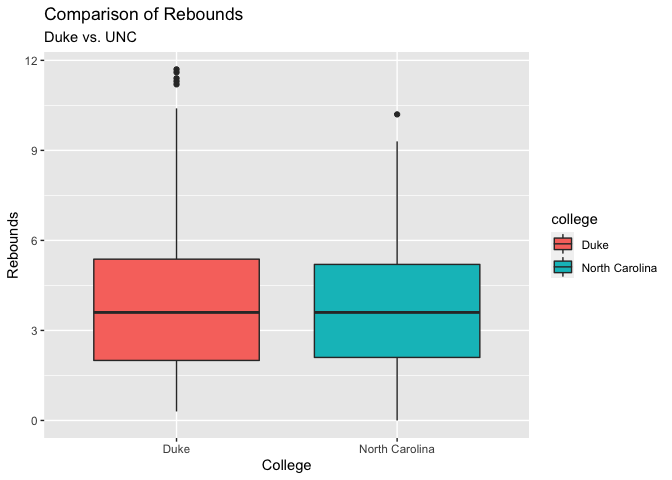<!-- -->

    ## `summarise()` ungrouping output (override with `.groups` argument)

    ## # A tibble: 2 x 3
    ##   college          med   iqr
    ##   <chr>          <dbl> <dbl>
    ## 1 Duke             3.6  3.38
    ## 2 North Carolina   3.6  3.1

We can see here that the median number of rebounds for a Duke player
(3.6) is exactly the same as that of a UNC player (3.6). The spread, as
indicated by the interquartile range, is greater for Duke players (3.38)
than for UNC players (3.1), which demonstrates that Duke produces more
variable rebounders than UNC does. There are more high rebounding
outliers in the Duke distribution than in the UNC distribution, but some
are present ine each distribution. The distribution of rebounds is
skewed slightly right for both schools.

Finally, we looked at the difference in the distribution of average
points between Duke and UNC players.

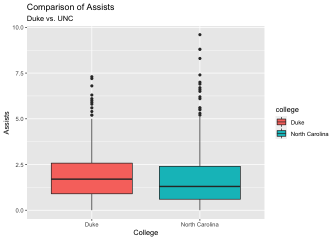<!-- -->

    ## `summarise()` ungrouping output (override with `.groups` argument)

    ## # A tibble: 2 x 3
    ##   college          med   iqr
    ##   <chr>          <dbl> <dbl>
    ## 1 Duke             1.7  1.68
    ## 2 North Carolina   1.3  1.8

We can see here that the median number of rebounds for a Duke player
(1.7) is greater that of a UNC player (1.3). The spread, as indicated by
the interquartile range, is lesser for Duke players (1.68) than for UNC
players (1.8), which demonstrates that UNC produces more variable
rebounders than Duke does. There are high assisting outliers in both the
Duke distribution and the UNC distribution. The distribution of assists
is skewed slightly right for both schools, but moreso for the UNC
distribution.

We observed that Duke players tend to have slightly more points and
rebounds than UNC players, but now we wanted to look more closely at
each group’s entire effect while on the court. We decided to next
compare net ratings because net ratings demonstrate by how much a team
outscores or is outscored by their opponent when a given player is on
the floor, and they should roughly tell us how each group of players’
teams play when they’re in the game.

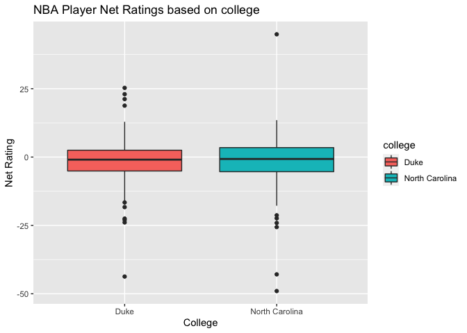<!-- -->

    ## `summarise()` ungrouping output (override with `.groups` argument)

    ## # A tibble: 2 x 3
    ##   college          med   iqr
    ##   <chr>          <dbl> <dbl>
    ## 1 Duke           -0.95   7.6
    ## 2 North Carolina -0.7    8.8

From simply looking at the side-by-side box plots and the summary
statistics, we were not able to notice any large differences between the
two populations. The medians are very close, indicating that the typical
Duke player has a net rating of -0.95 and the typical UNC player has a
net rating of -0.7. The variability, is indicated by the interquartile
range, is greater for UNC (8.8) than Duke (7.6).

### Question 2 Analysis and Discussion

Since the IQR is so great in comparison to the median, it’s difficult to
conclude anything from just this visualization and our summary
statistics. As this was only an initial step, we then proceeded to
conduct a hypothesis test to formally and thoroughly answer the question
at hand.

H0: UNC median net\_rating - Duke median net\_rating = 0

HA: UNC median net\_rating - Duke median net\_rating \!= 0

The next step in our hypothesis test was to calculate the observed
sample statistic: UNC median net\_rating - Duke median net\_rating.

    ## `summarise()` ungrouping output (override with `.groups` argument)

    ## [1] 0.25

The observed difference in sample median net ratings is 0.25.

We then generated a null distribution using permutation samples,
visualized it, and then calculated the p-value to help us deduce our
conclusions.

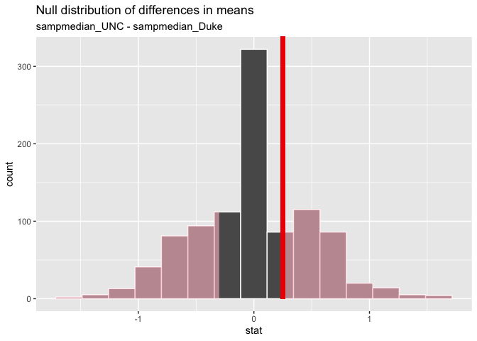<!-- -->

    ## # A tibble: 1 x 1
    ##   p_value
    ##     <dbl>
    ## 1   0.552

With a p-value of 0.552, which is greater than 0.05, we fail to reject
the null hypothesis and thus concluded that there was not sufficient
evidence to suggest a difference in average net rating between NBA
players from Duke and UNC. While we were mildly upset with this
conclusion (as Duke students), we came to the assertion that Duke and
UNC produce players that tend to perform equally as well in the NBA.

### Conclusion

Our first research questions analyzed which variables of a player’s
average statistics were the best predictors of his true shooting
percentage. We were curious to see if a multi-variable or
single-variable model was most accurate in predicting a player’s true
shooting percentage, so we did start with exploratory data analysis that
explored individual correlations between true shooting percentage and a
few variables we specifically wanted to test: player height, weight, and
usage percentage. But to really test our hypothesis, we used linear
regression models that would allow us to determine how much of a
player’s true shooting percentage could be explained by his usage
percentage, for example, or his age, or a combination of variables. We
then used our calculated regression equations and r-squared values for
each to help deduce our final results. But, we also wanted to test the
uncertainty of slopes that were calculated in our regression models.
This could help us determine how confident we were in what our
calculations suggested (and we were accordingly able to use
bootstrapping to create our related confidence levels). We were also
able to conduct a hypothesis test to see if the slopes of the regression
lines of the models were statistically significant. Ideally, these
hypothesis tests would support our findings in the confidence intervals
and that a slope, or a relationship between variable(s) and true
shooting percentage does exist. This was true for our single-variable
model, where we were determining by how much we could explain a player’s
true shooting percentage based on his usage percentage. On the other
hand, when testing the influence of a multitude of variables on a
player’s true shooting percentage, we were able to use backward
selection to determine the best fit model, which included the
coefficients of age, usage percentage, and player height. So, we were
able to conclude, through a hypothesis test, that a player’s age,
height, and usage percentage all hold an individual relationship with
his true shooting percentage. But, because our R-squared value for our
final selected multi-variable model was 0.0236, we concluded that albeit
the variables have statistically significant relationships with true
shooting percentage, they were not reliable. Essentially, we were able
to determine that player age, height and usage percentage were the best
predictors of true shooting percentage out of the variables we initially
selected. We also deduced, however, that they were not reliable enough
when it came to predicting true shooting percentage.

Thus, that brings us to analyze our statistical methods in recognizing
the lack of reliability of these predictors. The predictive power of the
model was not great, and there are numerous things we could have done to
try to determine a better model, from selecting a more up-to-date
dataset to starting with different variables, potentially even more than
just the four we thought were going to produce the most interesting
results. So, that suggests that part of what we could have done
differently that might have been quite influential is simply the process
of selection of data: choosing a data set, choosing variables, choosing
the relationship we wanted to test, choosing the types of models we
wanted to create, etc. Accordingly, within that process of selection are
indeed limitations. When choosing one variable we are simultaneously
choosing to exclude another that might have a stronger relationship to
true shooting percentage, for example. And so that’s why we should test
all of them, if possible, and that’s probably what we would have done if
we had more time to explore our research questions, especially when it
comes to a combination of various factors affecting true shooting
percentage. We determined the three best predictors operating together
from the selection we choose, but what if height was even more
influential when coupled with average number of rebounds? The methods of
statistical analysis we did choose to use, however, were relatively
appropriate. Given the scope of the class, a linear regression model
provided the best results when it came to determining just how much
certain variables affected true shooting percentage. That type of model
also allowed us to work with bi- and multi-variate relationships. We
also made sure to check the conditions for inference for regression,
which allowed us to be that much more certain that this method was most
appropriate to hopefully determine the best predictors of true shooting
percentage. We also ensured the certainty of the regression models, and
respective slopes, we were calculating by conducting hypothesis tests
and creating confidence intervals. All of that ensured that the answer
we were getting at first was almost certainly correct; our statistical
methods proved that it was. The multi-variate model, though, does tend
to get a bit more complicated, and our statistical methods might have
created false correlations or didn’t suggest ones that might truly exist
(ie. Simpson’s paradox). So, if we had more time, we might be able to go
through each variable and see what it affects most in the other
variables; for instance, if age affected weight, which then affected
true shooting percentage, but because we were looking at a combination
of variables, we were unable to determine the true influence of weight
given the influence age has on weight.

For our second question, we were trying to determine if a significant
difference existed between former Duke and UNC players who were now
playing in the NBA. We did conduct some exploratory analysis focusing
just on points scored, or average number of rebounds. But we really
wanted to focus on the overall net rating, and we figured conducting a
hypothesis test would produce more accurate results regarding whether or
not a difference exited between the two rival universities. Thus, from
our hypothesis test and resulting p-value, we could conclude that there
was not enough evidence to suggest a difference in average net rating
between NBA players from Duke and UNC. Therefore, we could not conclude
that Duke produced better basketball players than UNC; they both did
equally well in the NBA. We would like to point out, however, than when
visualizing the distributions of points scored and average number of
assists, Duke did perform better.

One of the first limitations within this question is that a player’s net
rating isn’t truly a great metric because it fails to isolate that
player’s contribution to the game. For example, if Jason was playing
with LeBron against two people, LeBron did all the work, and then they
won by 100 to 0, Jason’s net rating would still be +100 even though he
didn’t do anything. Essentially, the strength of the team as a whole
confounds the data of individual player net ratings; consequently, the
classic free rider problem manifests, and that certainly influences our
data analysis. Also, the dataset itself, as briefly mentioned as a
limitation for question one, could also cloud the true conclusion since
it might not include all equal data points for each player over the
years the set cataloged. Further, just in terms of the question, the
process of selection in what teams and players on whom we wanted to
focus, provides limitations. If given more time to explore, we could
expand the question to include other classic college basketball
university rivalries…and maybe even compare amongst the rivalries
themselves. We would also want to compare traditionally well-known and
established schools with more unknown or smaller schools to see if there
might be a significant difference in how well a player performs in the
NBA based on his college experience. And, we could dive into some of our
initial, more broad questions we had when first finding this dataset:
observing trends over seasons, for example, or how certain rule changes
affected the game and player stats, if at all, or if player performance
shifts depending on the team they play for during that season.

Regarding our statistical methods for our second question, though, we
appropriately used a hypothesis test to a sample population based off
our current data set and determine if a true significance existed
between NBA players’ performance based on their college – Duke or UNC.
Since we were only focused on two colleges, it was most appropriate to
use a relatively simple method to determine the validity (or lack
thereof) of our thinking that Duke players are better than UNC’s.
